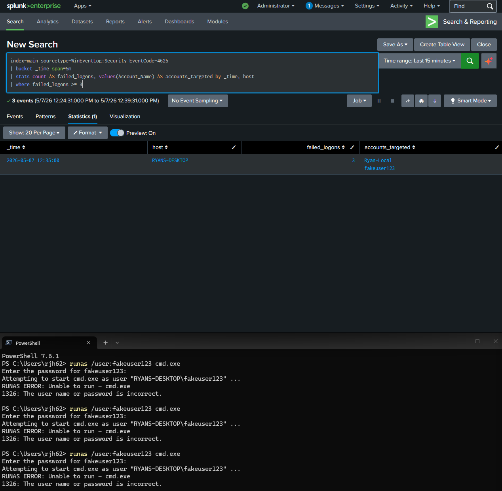
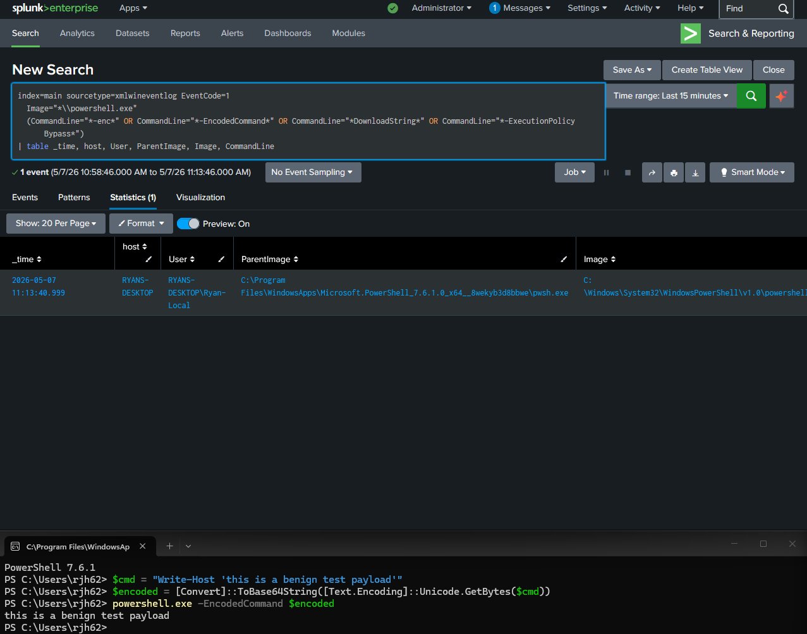
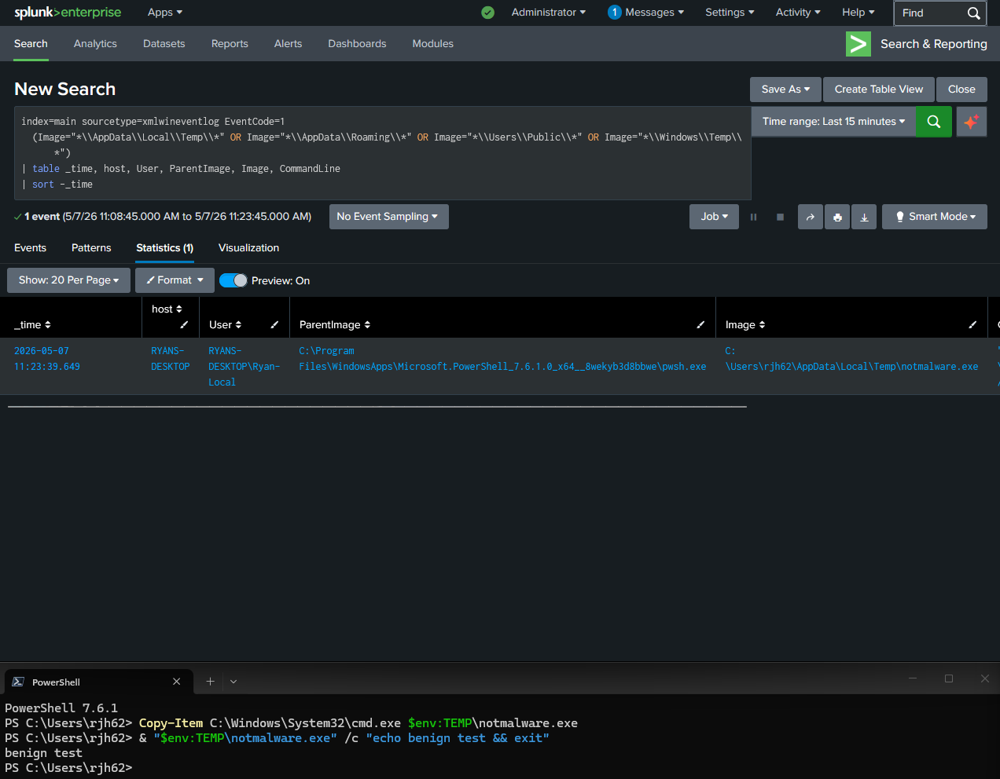
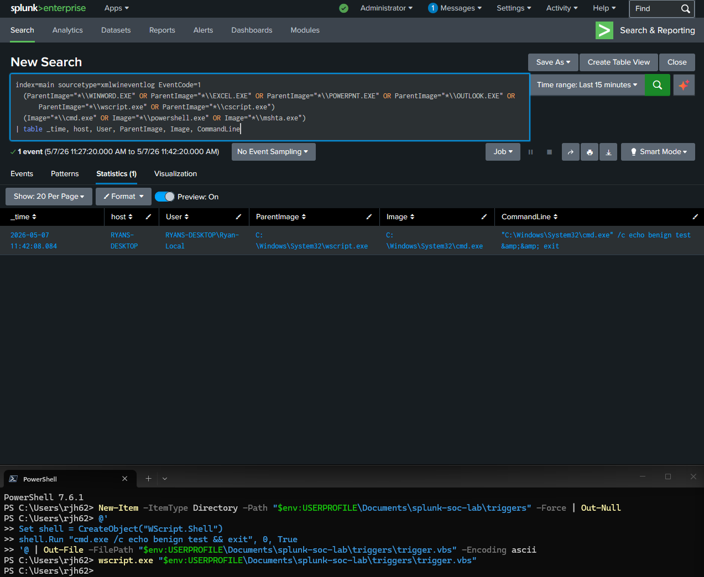
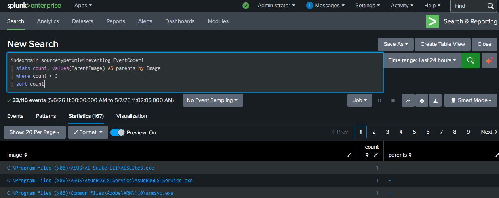

# Detection evidence

Each screenshot below shows the corresponding detection firing in Splunk against controlled adversary emulation activity performed on the lab host. The triggering activity was benign. For example, base64-encoding a `Write-Host` command rather than an actual malicious payload, but the *patterns* are faithful to real-world adversary tradecraft, which is what the detections key on.

## Detection 1: Failed logon brute force (T1110)

**Trigger:** Repeated `runas /user:fakeuser123 cmd.exe` invocations with incorrect passwords, generating Windows Security EventCode 4625 events.

**What the screenshot shows:** A 5-minute time bucket where `failed_logons` exceeded the threshold of 5, with `fakeuser123` listed in `accounts_targeted`.

## Detection 2: Suspicious PowerShell execution (T1059.001)

**Trigger:** A benign `Write-Host` command base64-encoded and executed via `powershell.exe -EncodedCommand`. The encoding pattern is what matters. It's the same technique attackers use to obfuscate malicious payloads.

**What the screenshot shows:** A Sysmon process-creation event for `powershell.exe` with `-EncodedCommand` and a base64 string in the CommandLine field.

## Detection 3: Process from suspicious location (T1036)

**Trigger:** The legitimate `cmd.exe` was copied to `%TEMP%\notmalware.exe` and executed. The binary itself is signed Microsoft code; the suspicious signal is the *path*.

**What the screenshot shows:** A process-creation event with `Image` pointing to `AppData\Local\Temp`, alongside other legitimate Temp-path activity (typical updater binaries). This illustrates the real-world false-positive challenge this detection class faces.

## Detection 4: Script host spawning a shell (T1566)

**Trigger:** A small VBScript run through `wscript.exe` that spawns `cmd.exe` to print "benign test." This faithfully reproduces the parent-child process chain that macro-based malware exhibits.

**What the screenshot shows:** A process-creation event where `ParentImage` is `wscript.exe` and `Image` is `cmd.exe`. There is essentially no legitimate reason for this chain to occur.

## Detection 5: Rare process by parent

**Trigger:** None. this is a hunting query that surfaces existing rare processes on the host. No emulation needed.

**What the screenshot shows:** A list of executables observed fewer than three times in the search window, with their parent process(es). This is the analyst's starting point for ad-hoc threat hunting.