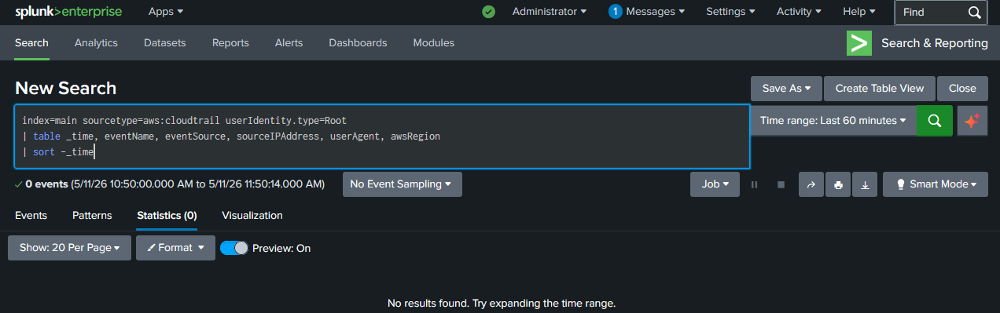
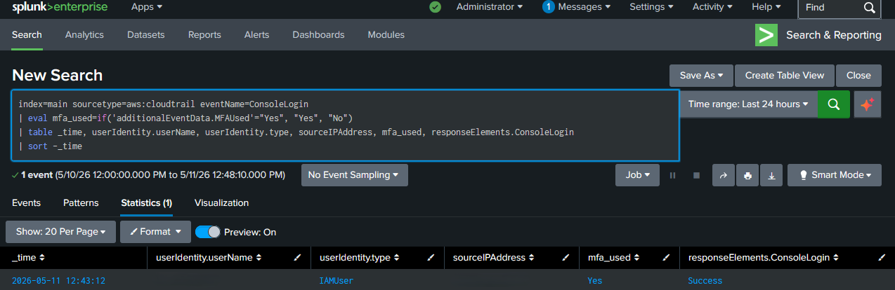
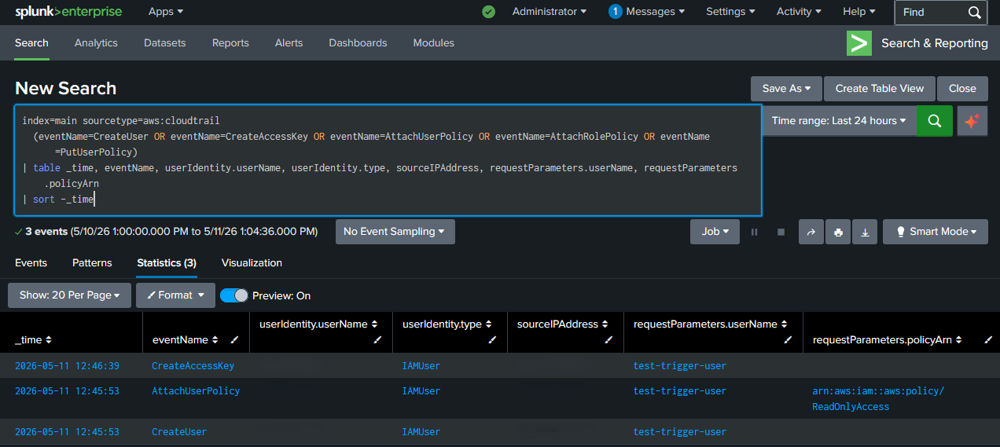

# Detection evidence

Each screenshot below shows the corresponding detection firing in Splunk against controlled adversary emulation activity performed on the lab host.

## Detection 1: Failed logon brute force (T1110)

**Trigger:** Repeated `runas /user:fakeuser123 cmd.exe` invocations with incorrect passwords, generating Windows Security EventCode 4625 events.

**What the screenshot shows:** A 5-minute time bucket where `failed_logons` exceeded the threshold of 5, with `fakeuser123` listed in `accounts_targeted`.

## Detection 2: Suspicious PowerShell execution (T1059.001)

**Trigger:** A benign `Write-Host` command base64-encoded and executed via `powershell.exe -EncodedCommand`. The encoding pattern is what matters. It's the same technique attackers use to obfuscate malicious payloads.

**What the screenshot shows:** A Sysmon process-creation event for `powershell.exe` with `-EncodedCommand` and a base64 string in the CommandLine field.

## Detection 3: Process from suspicious location (T1036)

**Trigger:** The legitimate `cmd.exe` was copied to `%TEMP%\notmalware.exe` and executed. The binary itself is signed Microsoft code; the suspicious signal is the *path*.

**What the screenshot shows:** A process-creation event with `Image` pointing to `AppData\Local\Temp`, alongside other legitimate Temp-path activity (typical updater binaries). This illustrates the real-world false-positive challenge this detection class faces.

## Detection 4: Script host spawning a shell (T1566)

**Trigger:** A small VBScript run through `wscript.exe` that spawns `cmd.exe` to print "benign test." This faithfully reproduces the parent-child process chain that macro-based malware exhibits.

**What the screenshot shows:** A process-creation event where `ParentImage` is `wscript.exe` and `Image` is `cmd.exe`. There is essentially no legitimate reason for this chain to occur.

## Detection 5: Rare process by parent

**Trigger:** None. this is a hunting query that surfaces existing rare processes on the host. No emulation needed.

**What the screenshot shows:** A list of executables observed fewer than three times in the search window, with their parent process(es). This is the analyst's starting point for ad-hoc threat hunting.

## Detection 6 — AWS root account usage (T1078.004)

**Trigger:** None. The root account was not used during the validation window.

**What the screenshot shows:** An empty result set. Per AWS best practice and CIS AWS Foundations Benchmark control 1.1, root account usage in steady-state should be zero. A populated result on this detection would itself be the finding worth investigating.

## Detection 7 — Console login without MFA (T1078.004)

**Trigger:** Deliberate sign-out and sign-in to the AWS console using the IAM admin user.

**What the screenshot shows:** A successful console login event with `mfa_used = Yes` and redactions to the username and source IP. The detection is built to surface logins where MFA was *not* used; a "Yes" value here demonstrates that the detection correctly populates the field and that the account's authentication posture is sound.

## Detection 8 — IAM user or access key creation (T1136.003)

**Trigger:** Created a throwaway IAM user (`test-trigger-user`), attached `ReadOnlyAccess`, and generated an access key. The user was deleted immediately after capture.

**What the screenshot shows:** Three related events: `CreateUser`, `AttachUserPolicy`, and `CreateAccessKey`. This is the textbook cloud-persistence pattern an attacker would use to establish durable access in a compromised AWS account. Same behavioral pattern, benign context, demonstrating why production triage must correlate detection hits with change management, authentication context, and downstream activity.